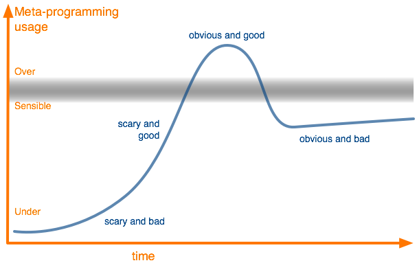

!SLIDE #title-slide

  
January 7, 2014

  

    SO META:
    Joys and Sorrows of Metaprogramming
  

  

    Hugo and James, pairing
  

  

  

!SLIDE smbullets incremental

- Scary and Bad: People are wary of meta-programming and don't use it much
- Scary and Good: people begin to see the value of meta-programming but are still uncomfortable with using it.
- Easy and Good: as people get comfortable they begin to use it too much, which can complicate the code-base.
- Easy and Bad: people are wary of meta-programming and realize that it's very useful in small doses.
